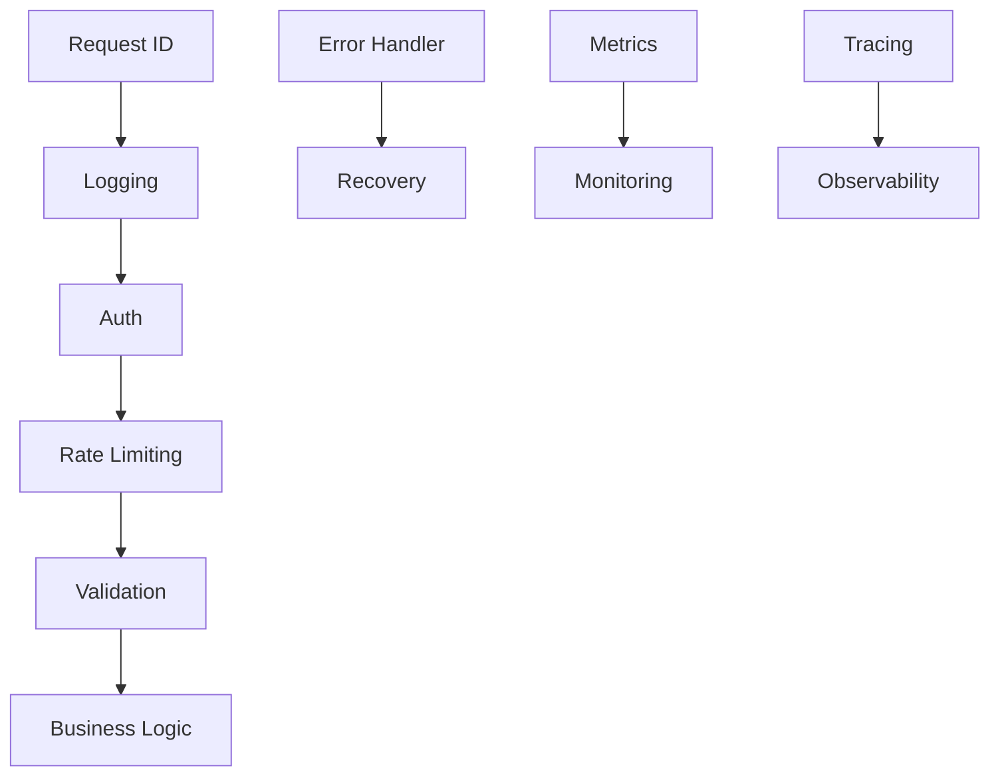

# LLMSafeSpace API Middlewares

This document provides detailed technical specifications for all middleware components in the LLMSafeSpace API system. Middlewares are executed in the order they're added to the Gin engine.

## Table of Contents

1. [Core Middlewares](#core-middlewares)
   - [Authentication](#authentication-middleware)
   - [Authorization](#authorization-middleware)
   - [Rate Limiting](#rate-limiting-middleware)
   - [Request Validation](#request-validation-middleware)
   - [Error Handling](#error-handling-middleware)
   - [Logging](#logging-middleware)

2. [Observability](#observability-middlewares)
   - [Metrics](#metrics-middleware)
   - [Tracing](#tracing-middleware)
   - [Request ID](#request-id-middleware)

3. [Security](#security-middlewares)
   - [CORS](#cors-middleware)
   - [Security Headers](#security-headers-middleware)
   - [WebSocket Security](#websocket-security-middleware)
   - [CSP Reporting](#csp-reporting-middleware)

4. [Infrastructure](#infrastructure-middlewares)
   - [Recovery](#recovery-middleware)
   - [Middleware Chaining](#middleware-chaining)

---

## Core Middlewares

### Authentication Middleware
**File**: `auth.go`  
**Purpose**: Handles API key/token authentication and user context propagation  
**Key Features**:
- Multiple token sources (Header, Cookie, Query param)
- Role-based path exemptions
- Contextual logging with user ID
- Token validation via AuthService interface

**Configuration** (`AuthConfig` struct):
```go
type AuthConfig struct {
  HeaderName       string   // Authorization header name
  QueryParamName   string   // URL query parameter name
  CookieName       string   // Cookie name
  TokenType        string   // Expected token prefix (e.g., "Bearer")
  SkipPaths        []string // Paths to exclude
  SkipPathPrefixes []string // Path prefixes to exclude
}
```

**Usage**:
```go
router.Use(middleware.AuthMiddleware(authService, logger, middleware.AuthConfig{
  TokenType: "APIKey",
  SkipPaths: []string{"/public"},
}))
```

### Authorization Middleware
**File**: `auth.go`  
**Purpose**: Implements RBAC and resource-based access control  
**Key Features**:
- Permission/role requirements
- Resource ownership checks
- Integration with AuthService interface

**Methods**:
- `RequirePermissions(perms ...string)`
- `RequireRoles(roles ...string)`

**Usage**:
```go
router.GET("/admin", 
  middleware.RequirePermissions("admin:read"),
  adminHandler,
)
```

### Rate Limiting Middleware
**File**: `rate_limit.go`  
**Purpose**: Implements distributed rate limiting  
**Strategies**:
1. Token Bucket (default)
2. Fixed Window
3. Sliding Window

**Configuration** (`RateLimitConfig`):
```go
type RateLimitConfig struct {
  Enabled       bool
  DefaultLimit  int           // Requests per window
  DefaultWindow time.Duration // Time window
  BurstSize     int           // Token bucket capacity
  Strategy      string        // "token_bucket", "fixed_window", "sliding_window"
  ExemptRoles   []string      // Bypass roles
  CustomLimits  map[string]int // Per-client overrides
}
```

**Headers**:
- `X-RateLimit-Limit`
- `X-RateLimit-Remaining`
- `X-RateLimit-Reset`

### Request Validation Middleware
**File**: `validation.go`  
**Purpose**: Validates request bodies against struct definitions  
**Features**:
- Automatic JSON validation
- Custom validation rules
- Sensitive data masking
- Multi-source validation (body, query, params)

**Validation Tags**:
```go
type Request struct {
  Email    string `json:"email" validate:"required,email"`
  Password string `json:"password" validate:"required,min=8"`
}
```

**Custom Validators**:
- `nohtml` - Disallow HTML tags
- `iso8601` - Validate datetime format
- `alphanum_space` - Only allow alphanumeric + spaces

### Error Handling Middleware
**File**: `error_handler.go`  
**Purpose**: Centralized error processing and formatting  
**Features**:
- APIError struct standardization
- Stack trace management
- Error response normalization
- Sensitive data redaction

**Error Types**:
```go
ErrorTypeAuthentication
ErrorTypeAuthorization
ErrorTypeValidation
ErrorTypeRateLimit
ErrorTypeNotFound
ErrorTypeInternal
```

### Logging Middleware
**File**: `logging.go`  
**Purpose**: Structured request/response logging  
**Features**:
- Request/response body capture
- Sensitive field masking
- Size-based truncation
- Contextual logging (request ID, user ID)

**Configuration** (`LoggingConfig`):
```go
type LoggingConfig struct {
  LogRequestBody  bool
  LogResponseBody bool
  MaxBodyLogSize  int         // Truncation threshold
  SensitiveFields []string    // Fields to mask
  SkipPaths       []string    // Excluded paths
}
```

---

## Observability Middlewares

### Metrics Middleware
**File**: `metrics.go`  
**Purpose**: Collects API performance metrics  
**Tracked Metrics**:
- HTTP request duration
- Response sizes
- WebSocket connections
- Code execution stats

**Prometheus Metrics**:
- `http_requests_total`
- `http_request_duration_seconds`
- `ws_connections_active`
- `code_executions_total`

### Tracing Middleware
**File**: `tracing.go`  
**Purpose**: Distributed tracing context management  
**Features**:
- Request ID generation/propagation
- OpenTelemetry integration
- Contextual logging
- Latency tracking

**Configuration** (`TracingConfig`):
```go
type TracingConfig struct {
  HeaderName         string // Context header
  PropagateHeader    bool   // Forward header
  GenerateIfMissing  bool   // Auto-generate IDs
  UseUUID            bool   // UUID vs random string
  EnableOpenTelemetry bool  // OTel integration
}
```

### Request ID Middleware
**File**: `request_id.go`  
**Purpose**: Unique request identification  
**Features**:
- UUIDv4 generation
- Header propagation
- Context storage
- Validation of incoming IDs

---

## Security Middlewares

### CORS Middleware
**File**: `cors.go`  
**Purpose**: Cross-Origin Resource Sharing control  
**Configuration** (`CORSConfig`):
```go
type CORSConfig struct {
  AllowedOrigins    []string
  AllowedMethods    []string
  AllowedHeaders    []string
  ExposedHeaders    []string
  AllowCredentials  bool
  MaxAge            int
  OptionsPassthrough bool // Custom OPTIONS handling
}
```

### Security Headers Middleware
**File**: `security.go`  
**Purpose**: HTTP header security hardening  
**Headers Set**:
- Content-Security-Policy
- Strict-Transport-Security
- X-Content-Type-Options
- X-Frame-Options
- Permissions-Policy

**Configuration** (`SecurityConfig`):
```go
type SecurityConfig struct {
  ContentSecurityPolicy string
  RequireHTTPS         bool
  TrustedProxies       []string
  PermissionsPolicy    string
  Development          bool // Relax restrictions
}
```

### WebSocket Security Middleware
**File**: `security.go`  
**Purpose**: Secures WebSocket connections  
**Features**:
- Origin validation
- Protocol version enforcement
- Connection lifecycle tracking

### CSP Reporting Middleware
**File**: `security.go`  
**Purpose**: Handles Content Security Policy violation reports  
**Endpoint**: `/api/v1/csp-report`  
**Logging**: Captures full violation details

---

## Infrastructure Middlewares

### Recovery Middleware
**File**: `recovery.go`  
**Purpose**: Panic recovery and stabilization  
**Features**:
- Stack trace capture
- Broken connection detection
- Custom recovery handlers
- Error normalization

**Configuration** (`RecoveryConfig`):
```go
type RecoveryConfig struct {
  IncludeStackTrace bool // Response visibility
  LogStackTrace     bool // Log visibility
  CustomRecoveryHandler func(*gin.Context, interface{})
}
```

### Middleware Chaining
**Key Considerations**:
1. Order-sensitive execution
2. Context propagation
3. Error handling hierarchy
4. Performance impact

**Recommended Order**:
1. Recovery
2. Security Headers
3. Tracing/Request ID
4. Logging
5. Auth
6. Rate Limiting
7. Validation
8. Business Logic

**Example Chain**:
```go
router.Use(
  middleware.RecoveryMiddleware(logger),
  middleware.SecurityMiddleware(logger),
  middleware.TracingMiddleware(logger),
  middleware.LoggingMiddleware(logger),
  middleware.AuthMiddleware(authService, logger),
  middleware.RateLimitMiddleware(limiter, logger, config),
)
```

---

## Dependency Graph



All middlewares integrate with the centralized logger and error handling systems. Security middlewares should be mounted early in the chain, while observability middlewares benefit from being first to capture full request lifecycle data.
