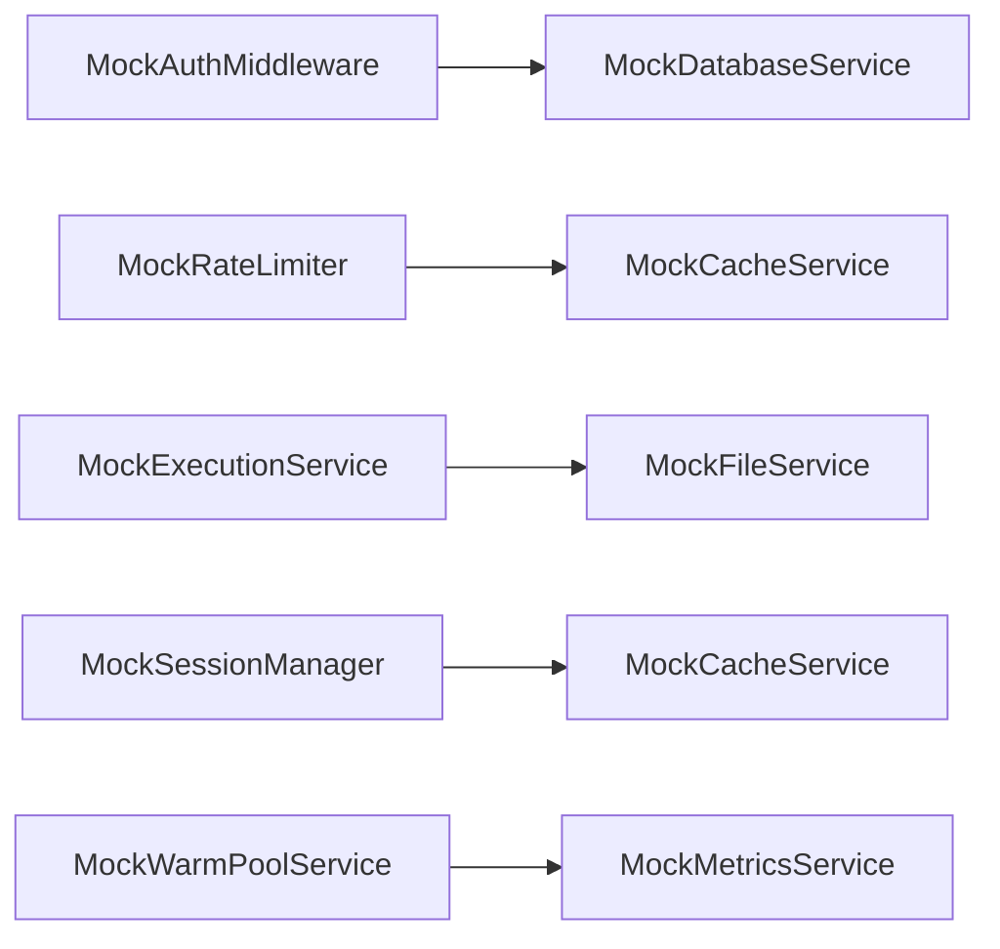

# LLMSafeSpace API Mock Services

This document provides detailed technical specifications for all mock service implementations used in testing the LLMSafeSpace API system. All mocks implement the `Start()` and `Stop()` lifecycle methods for dependency management.

## Mock Services Index

1. [Authentication](#mockauthmiddlewareservice)
2. [Rate Limiting](#mockratelimiterservice)
3. [Database](#mockdatabaseservice)
4. [Cache](#mockcacheservice)
5. [Execution](#mockexecutionservice)
6. [File Operations](#mockfileservice)
7. [Metrics](#mockmetricsservice)
8. [Session Management](#mocksessionmanager)
9. [Warm Pools](#mockwarmpoolservice)

---

## MockAuthMiddlewareService
**File**: `middleware_mocks.go`
**Implements**: AuthService interface
**Key Methods**:
```go
ValidateToken(token string) (string, error)  // Returns (userID, error)
CheckResourceAccess(userID, resourceType, resourceID, action string) bool
AuthenticateAPIKey(ctx, apiKey) (string, error)  // Returns (userID, error)
AuthMiddleware() gin.HandlerFunc
```

**Test Usage**:
```go
mockAuth := new(MockAuthMiddlewareService)
mockAuth.On("ValidateToken", "valid-token").Return("user123", nil)
```

---

## MockRateLimiterService
**File**: `ratelimiter.go`
**Implements**: RateLimiterService interface
**Key Methods**:
```go
Allow(key string, rate float64, burst int) bool
Increment(ctx, key string, value int64, expiration time.Duration) (int64, error)
CountInWindow(ctx, key string, min, max int64) (int, error)
```

**Rate Limit Strategies**:
- Token Bucket (`Allow`)
- Sliding Window (`Increment` + `CountInWindow`)

---

## MockDatabaseService
**File**: `database.go`
**Implements**: DatabaseService interface
**Key Methods**:
```go
GetUserByID(ctx, userID) (map[string]interface{}, error)
CheckResourceOwnership(userID, resourceType, resourceID string) (bool, error)
CreateSandboxMetadata(ctx, sandboxID, userID, runtime string) error
```

**Data Patterns**:
- Returns `map[string]interface{}` for complex objects
- Uses boolean returns for access checks

---

## MockCacheService
**File**: `cache.go`
**Implements**: CacheService interface
**Features**:
```go
Get/Set/Delete(key string)  // Basic operations
GetObject/SetObject(key string, value interface{})  // Serialization
GetSession/SetSession(sessionID string)  // Specialized session handling
```

**Serialization**:
- Uses `interface{}` for object storage
- Automatic JSON marshaling/unmarshaling

---

## MockExecutionService
**File**: `execution.go`
**Implements**: ExecutionService interface
**Key Methods**:
```go
Execute(ctx, sandbox, execType, content, timeout) (*types.ExecutionResult, error)
ExecuteStream(ctx, sandbox, execType, content, timeout, callback)
InstallPackages(ctx, sandbox, packages, manager)
```

**Execution Modes**:
- Blocking (`Execute`)
- Streaming (`ExecuteStream` with callback)
- Package management (`InstallPackages`)

---

## MockFileService
**File**: `file.go`
**Implements**: FileService interface
**Operations**:
```go
ListFiles(ctx, sandbox, path) ([]types.FileInfo, error)
DownloadFile(ctx, sandbox, path) ([]byte, error)
UploadFile(ctx, sandbox, path, content) (*types.FileInfo, error)
```

**File Info Structure**:
```go
type FileInfo struct {
  Name     string
  Path     string
  Size     int64
  IsDir    bool
  Modified time.Time
}
```

---

## MockMetricsService
**File**: `metrics.go`
**Implements**: MetricsService interface
**Tracking Dimensions**:
```go
RecordRequest(method, path, status, duration, size)
RecordSandboxCreation(runtime, warmPodUsed, userID)
RecordResourceUsage(sandboxID, cpu, memory)
RecordWarmPoolMetrics(runtime, poolName, utilization)
```

**Metric Types**:
- HTTP request metrics
- Resource utilization
- Warm pool statistics
- Error tracking

---

## MockSessionManager
**File**: `session.go`
**Implements**: SessionManager interface
**Lifecycle Methods**:
```go
CreateSession(userID, sandboxID, conn) (*types.Session, error)
CloseSession(sessionID)
SetCancellationFunc(sessionID, executionID, cancel)
CancelExecution(sessionID, executionID) bool
```

**Session Structure**:
```go
type Session struct {
  ID            string
  UserID        string
  SandboxID     string
  Connection    types.WSConnection
  Executions    map[string]context.CancelFunc
}
```

---

## MockWarmPoolService
**File**: `warmpool.go`
**Implements**: WarmPoolService interface
**Key Methods**:
```go
GetWarmSandbox(ctx, runtime) (string, error)
CheckAvailability(ctx, runtime, securityLevel) (bool, error)
CreateWarmPool(ctx, req) (*types.WarmPool, error)
UpdateWarmPool(ctx, req) (*types.WarmPool, error)
```

**Pool Management**:
- Capacity checks
- Auto-scaling simulation
- Pool status reporting

---

## Mock Dependencies Graph



## Testing Patterns

**Typical Test Setup**:
```go
func TestEndpoint(t *testing.T) {
  // Initialize mocks
  mockAuth := new(MockAuthMiddlewareService)
  mockDB := new(MockDatabaseService)
  mockCache := new(MockCacheService)

  // Setup expectations
  mockAuth.On("ValidateToken", "test-token").Return("user1", nil)
  mockDB.On("GetUserByID", mock.Anything, "user1").Return(map[string]interface{}{
    "id": "user1",
    "roles": []string{"user"},
  }, nil)

  // Test router setup
  router := gin.New()
  router.Use(middleware.AuthMiddleware(mockAuth, logger))
  // ... test logic
}
```

**Verification**:
```go
mockAuth.AssertCalled(t, "ValidateToken", "test-token")
mockDB.AssertNumberOfCalls(t, "GetUserByID", 1)
mockCache.AssertNotCalled(t, "GetSession")
```

---

## Best Practices

1. **Lifecycle Management**:
   - Call `Start()`/`Stop()` in test setup/teardown
   - Reset mock states between tests

2. **Argument Matching**:
   ```go
   // Exact match
   mock.On("Method", "exact-value")

   // Type match
   mock.On("Method", mock.AnythingOfType("string"))

   // Custom matcher
   mock.On("Method", mock.MatchedBy(func(arg string) bool {
     return strings.HasPrefix(arg, "test-")
   }))
   ```

3. **Concurrency**:
   - Use `mock.Mock.IsRunning()` to verify goroutine safety
   - Set `mock.Test(T)` for parallel test compatibility
