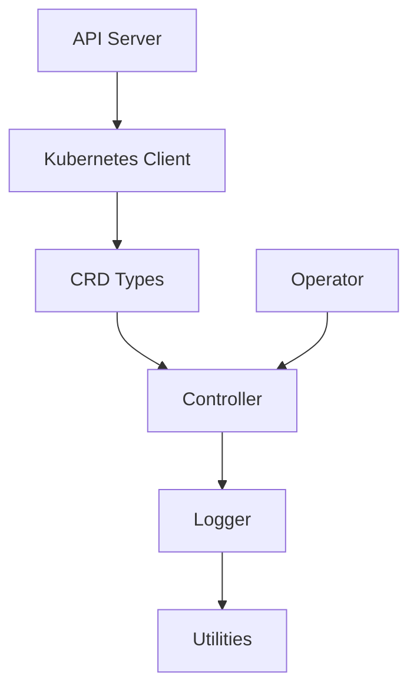

# LLMSafeSpace Core Packages

This document provides technical documentation for the core Go packages that power the LLMSafeSpace platform. All packages follow Go 1.19+ conventions and Kubernetes operator patterns.

## Table of Contents

1. [Kubernetes Client](#kubernetes-client)
2. [CRD Definitions](#crd-definitions)
3. [Utilities](#utilities)
4. [Logging](#logging)
5. [HTTP Utilities](#http-utilities)
6. [Configuration](#configuration)
7. [Interfaces](#interfaces)
8. [Testing Strategy](#testing-strategy)

---

## Kubernetes Client

**Package:** `kubernetes`
**Key Components:**
- Client management with leader election
- Custom resource informers (30s resync interval)
- Sandbox operations executor
- Warm pool/pod controller
- Distributed command execution (exec API)

**Key Features:**
```go
// Create a Kubernetes client
cfg := &config.KubernetesConfig{
    InCluster: true,
    Namespace: "default",
    LeaderElection: config.LeaderElectionConfig{
        Enabled: true,
        LeaseDuration: 15 * time.Second,
    },
}
client, err := kubernetes.New(cfg, logger)

// Start informers and leader election
client.Start()
defer client.Stop()

// Execute code in sandbox
result, err := client.ExecuteInSandbox(ctx, "ns", "demo", &types.ExecutionRequest{
    Type:    "code",
    Content: "print('Hello World')",
    Timeout: 30,
})

// Stream files from sandbox
fileList, err := client.ListFilesInSandbox(ctx, "ns", "demo", &types.FileRequest{
    Path: "/workspace",
})
```

**Informer Types:**
- Sandbox (watch for phase changes)
- WarmPool (track capacity metrics)
- WarmPod (monitor assignment status)
- RuntimeEnvironment (validate availability)
- SandboxProfile (apply security profiles)

---

## CRD Definitions

**Package:** `types`
**Custom Resources:**

1. **Sandbox** (`llmsafespace.dev/v1`)
   - Spec: Runtime, SecurityLevel, ResourceRequirements, NetworkPolicy
   - Status: Phase (Pending/Running/Terminated), PodName, ResourceUsage
   ```go
   sb := &types.Sandbox{
       Spec: types.SandboxSpec{
           Runtime: "python:3.10",
           SecurityLevel: "high",
           Resources: &types.ResourceRequirements{
               CPU: "1000m",
               Memory: "2Gi",
           },
       },
   }
   ```

2. **WarmPool** (`llmsafespace.dev/v1`)
   - Spec: Min/MaxSize, TTL, PreloadScripts, AutoScaling
   - Status: AvailablePods, AssignedPods, ScalingHistory

3. **RuntimeEnvironment** (`llmsafespace.dev/v1`)
   - Spec: Language, Version, PreInstalledPackages
   - Status: Available, LastValidated

4. **SandboxProfile** (`llmsafespace.dev/v1`)
   - Security baselines with NetworkPolicies and Seccomp profiles
   ```yaml
   apiVersion: llmsafespace.dev/v1
   kind: SandboxProfile
   metadata:
     name: python-secure
   spec:
     language: python
     securityLevel: high
     seccompProfile: /profiles/python-secure.json
   ```

---

## Utilities

**Package:** `utilities`
**Core Functions:**

1. **Secure Hashing**
   ```go
   hashed := utilities.HashString("sensitive-data") // SHA-256 hex digest
   ```

2. **Data Masking**
   ```go
   masked := utilities.MaskString("API_KEY_12345") // "API...2345"
   utilities.MaskSensitiveFields(map[string]interface{}{
       "password": "secret",
       "metadata": map[string]string{"token": "abc123"},
   })
   ```

3. **File Path Validation**
   ```go
   valid := utilities.ValidatePath("/safe/dir", userInputPath)
   ```

4. **Kubernetes Helpers**
   - Safe label/value formatting
   - Resource quantity conversions
   - Condition status checks

---

## Logging

**Package:** `logger`
**Features:**
- Zap-based structured logging
- Contextual field injection
- Dynamic log level control
- Sensitive data filtering

**Usage:**
```go
// Initialize logger
logger, _ := logger.New(true, "debug", "json")

// Contextual logging
ctxLogger := logger.With("requestID", "12345")
ctxLogger.Info("Processing request",
    "user", "user@example.com",
    "action", "create_sandbox")

// Error handling
if err := operation(); err != nil {
    logger.Error("Operation failed", err,
        "duration", time.Since(start),
        "attempt", 3)
}
```

**Log Levels:**
- `debug`: Development diagnostics
- `info`: Service lifecycle events
- `warn`: Non-critical issues
- `error`: Operational failures
- `fatal`: Unrecoverable errors

---

## HTTP Utilities

**Package:** `http`
**Components:**

1. **BodyCaptureWriter**
   - Gin middleware for response inspection
   - Supports size-limited buffering (4KB default)

**Middleware Setup:**
```go
router.Use(func(c *gin.Context) {
    bw := http.NewBodyCaptureWriter(c)
    c.Writer = bw
    c.Next()

    // Log response body
    logger.Info("HTTP response",
        "status", c.Writer.Status(),
        "body", utilities.Truncate(bw.GetBody(), 1000))
})
```

2. **Safe HTTP Client**
   - TLS verification enforcement
   - Timeout handling (15s default)
   - Circuit breaker integration

---

## Configuration

**Package:** `config`
**Structure:**
```go
type Config struct {
    Server struct {
        Host            string        `mapstructure:"host"`
        Port            int           `mapstructure:"port"`
        ShutdownTimeout time.Duration `mapstructure:"shutdownTimeout"`
    } `mapstructure:"server"`

    Kubernetes struct {
        InCluster      bool
        ConfigPath     string
        LeaderElection struct {
            Enabled         bool
            LeaseDuration   time.Duration
            RenewDeadline   time.Duration
        }
    } `mapstructure:"kubernetes"`

    Redis struct {
        Host     string
        TLS      bool
        PoolSize int
    } `mapstructure:"redis"`
}
```

**Loading:**
```go
var cfg config.Config
viper.Unmarshal(&cfg)

// Validate
if cfg.Kubernetes.LeaderElection.LeaseDuration < 10*time.Second {
    return errors.New("lease duration too short")
}
```

---

## Interfaces

**Package:** `interfaces`
**Key Contracts:**

1. **KubernetesClient**
   ```go
   type KubernetesClient interface {
       ExecuteInSandbox(ctx, ns, name string, req *types.ExecutionRequest) (*types.ExecutionResult, error)
       ListFilesInSandbox(ctx, ns, name string, req *types.FileRequest) (*types.FileList, error)
       UpdateSandboxStatus(ctx, ns, name string, status *types.SandboxStatus) error
   }
   ```

2. **LoggerInterface**
   ```go
   type LoggerInterface interface {
       With(keysAndValues ...interface{}) LoggerInterface
       Sync() error
       // Levels: Debug, Info, Warn, Error, Fatal
   }
   ```

3. **CRD Operations**
   - SandboxInterface: Get/Update/Watch sandboxes
   - WarmPoolInterface: Scale pools, check capacity
   - RuntimeEnvironmentInterface: Validate runtimes

---

## Testing Strategy

1. **Mock Implementations**
   - `MockKubernetesClient`: Simulate CRUD operations
   - `FakeLogger`: Capture log outputs
   - `MemoryCRDStore`: In-memory CRD storage

2. **Test Patterns**
   ```go
   func TestSandboxCreate(t *testing.T) {
       mockClient := mocks.NewMockKubernetesClient()
       mockClient.On("CreateSandbox", mock.Anything).
           Return(&types.Sandbox{Spec: testSpec}, nil)

       controller := NewController(mockClient)
       err := controller.Reconcile(testCase)

       assert.NoError(t, err)
       mockClient.AssertCalled(t, "UpdateStatus", mock.Anything)
   }
   ```

3. **Golden Files**
   - Store expected CRD manifests in `testdata/`
   - Validate serialization/deserialization
   ```go
   golden.AssertJSON(t, actualSandbox, "testdata/sandbox-default.golden")
   ```

4. **Benchmarks**
   - CRD list operations
   - Concurrent execution handling
   - Informer cache performance

---

## Dependency Graph



All packages integrate through the central logger and follow Kubernetes operator patterns for consistency.
